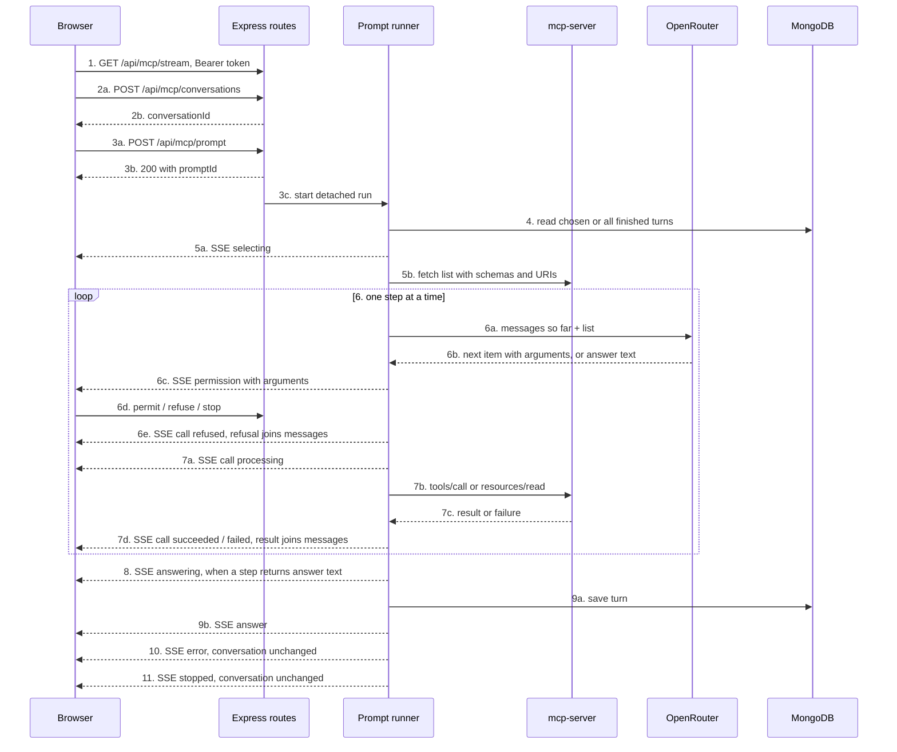

# Express MCP client implementation plan

Ticket: [docs/tickets/mcp/tkt-mcp-002-express-client.md](docs/tickets/mcp/tkt-mcp-002-express-client.md) · branch `feat/tkt-mcp-002-express-client`

The MCP server already exists and runs on the `private` Compose network ([mcp-backend](mcp-backend), service `mcp-server`), stateless JSON over `POST /mcp`, protocol `2026-07-28`. The transport client in `backend/src/aop/mcp/client/` is done. Everything else below is new backend work.

The prompt runs as a step loop, the way Claude Code and Cursor run tools. Each step, the model sees everything so far and picks the next tool or resource with its arguments. The user allows or refuses that exact call. Its result, or the refusal, joins the messages, and the next step starts. The loop ends when the model writes the answer. A prompt with N steps costs N + 1 model calls.

## Flow

Step to section map:

- 1, 2, 3, 6d: Section 7 (HTTP surface)
- 5b, 7b: Section 2 (MCP transport)
- 4, 9a: Section 5 (persistence)
- 6a, 6b: Section 3 (model gateway)
- 5a, 6c, 6e, 7a, 7d, 8, 9b, 10, 11: Section 4 (event contract) + Section 6 (runtime)
- 6, 7: Section 6 (runtime)
- 10, 11: Section 6 (failure and stop paths)

## Section 1 — Config and environment

- [backend/src/config/schemas/index.ts](backend/src/config/schemas/index.ts): add `openRouterApiKeySchema`, `openRouterModelSchema`, `mcpServerUrlSchema`, `mongoMcpConversationsCollectionNameSchema`.
- [backend/src/config/utils/validate-common.ts](backend/src/config/utils/validate-common.ts): parse each with `parseSchema` and return them, matching the existing fail-fast style.
- [backend/src/aop/db/mongo/config/index.ts](backend/src/aop/db/mongo/config/index.ts): add an `mcpConversations` collection entry with `indexKeys: { userId: 1 }`, `unique: false`.
- `backend/.env.dev` and `backend/.env.prod`: add `OPENROUTER_API_KEY`, `OPENROUTER_MODEL`, `MCP_SERVER_URL=http://mcp-server:3000/mcp`, `MONGO_MCP_CONVERSATIONS_COLLECTION_NAME`.

Gaps (Resolved):

- Resolved: the model provider is OpenRouter. `OPENROUTER_API_KEY` and `OPENROUTER_MODEL` are required, present in the backend env files, and read as `config.openRouterApiKey` and `config.openRouterModel`.

- Resolved: `MCP_SERVER_URL` and `MONGO_MCP_CONVERSATIONS_COLLECTION_NAME` are required and present in the backend env files. Config is fail-fast at import, so the backend will not boot without them.
- [tests/mcp/compose.override.yml](tests/mcp/compose.override.yml) deliberately clears the backend `env_file`. The exposure test's `compose run backend` only works because it overrides the entrypoint with `node -e` and never imports `config`. Worth re-running `npm run test:mcp` after Section 1 to confirm.
- Resolved: the MCP server address is `MCP_SERVER_URL` (dev and prod: `http://mcp-server:3000/mcp`), not a constant. [exposure.md](docs/specs/architecture/http/mcp/exposure.md) still describes that address.

## Section 2 — MCP transport client (steps 5b, 7b)

`backend/src/aop/mcp/client/`. No SDK needed: the server is stateless JSON, so plain `fetch` is enough. Copy the exact envelope the exposure test already proves works — see [tests/mcp/exposure.test.mjs](tests/mcp/exposure.test.mjs) lines 50-68: `Mcp-Method` and `MCP-Protocol-Version` headers plus `params._meta["io.modelcontextprotocol/protocolVersion"]`, `clientInfo`, `clientCapabilities`.

- Methods: `listTools`, `listResources`, `listResourceTemplates`, `callTool`, `readResource`. Every method takes an `AbortSignal` so stop can cancel in-flight work (FR-MCP-STP-004).
- Validate each response with Zod through `parseSchema`; failure throws `SchemaValidationException`.
- Domain for each item comes from `_meta.domain` (see [mcp-backend/src/modules/whatsapp/index.ts](mcp-backend/src/modules/whatsapp/index.ts)). Keep a `{ domain, name } -> uri` map built from `resources/list` so a selected resource resolves to a URI for `resources/read`.
- A resource template is read by expanding its URI template with the arguments the model filled for that step (HTTP-MCP-ARG-001, HTTP-MCP-ARG-002).
- A JSON-RPC `error` response, a non-200, or a connection failure is a server failure, surfaced to the runner for the `error` event (HTTP-MCP-FLR-002).
- The client doc comments say "catalog"; update them to "list" to match the specs.

## Section 3 — Model gateway (steps 6a, 6b)

`backend/src/aop/mcp/gateway/`, class `ModelGateway`. One kind of model call, the step, sent to the OpenRouter chat completions endpoint with `config.openRouterApiKey` and `config.openRouterModel`.

Path: `gateway`, not `model`. `client` is named for its role. `model` would name the remote system and read as a domain model beside the transport client.

- Input: the messages so far (context turns, the prompt, earlier results and refusals) + the MCP list as `tools`. Each tool, resource, and resource template becomes one function, since function calling only knows tools. A tool's function takes its input schema; a template's function takes its URI template variables; a concrete resource's function takes no arguments.
- `parallel_tool_calls: false`, so each step returns at most one item (HTTP-MCP-SEL-002).
- Output: a `tool_calls` entry is the next tool or resource with its arguments; plain `content` is the answer text (FR-MCP-SEL-001, FR-MCP-SEL-011, HTTP-MCP-ARG-001).
- Arguments are checked against that item's input schema or URI template. An item outside the list counts as malformed output.
- Function names map back to `{ domain, name, kind }` through a lookup built with the list.
- The gateway takes `fetchImpl`, like the MCP client, so tests can pass a fake.
- Messages use the record shape `{ role: "user" | "assistant" | "tool" | "resource", content: string }`. `tool` and `resource` are sent as user messages labeled `Tool result` and `Resource result`, because the provider accepts a `tool` role only after an assistant `tool_calls` entry, and the record does not keep a call id.
- The step returns `{ type: "selection", domain, name, kind, arguments }` or `{ type: "answer", content }`. `kind` is `"tool"` or `"resource"`. A resource template is `kind: "resource"`. A list that repeats `{ kind, domain, name }`, including a concrete resource and a template with the same domain and name, is rejected before the call.
- A non-200, malformed output, or network failure throws `ExternalServiceException` (`MODEL_PROVIDER_REQUEST_FAILED`). An aborted request is rethrown.

Every call passes the run's `AbortSignal`. Any non-200, malformed output, or network failure ends the prompt as a provider failure.

Gaps (Resolved):

- Resolved: the provider is OpenRouter, using the Section 1 config.
- Resolved: the folder is `backend/src/aop/mcp/gateway/`, class `ModelGateway`.

## Section 4 — Event contract (steps 5a, 6c, 6e, 7a, 7d, 8, 9b, 10, 11)

The emitter validates every event against an exhaustive schema map, so MCP events must be registered in three places.

- [backend/src/shared/constants/events/index.ts](backend/src/shared/constants/events/index.ts): add an `mcp` group whose values are the exact wire `type` strings from [prompt.md](docs/specs/architecture/http/mcp/prompt.md): `selecting`, `permission`, `call`, `answering`, `answer`, `error`, `stopped`.
- New `backend/src/shared/schemas/mcp/events/` and `backend/src/shared/types/mcp/events/`: one Zod schema per event with exactly the fields each acceptance scenario lists:
  - Every event carries `type` and `promptId`.
  - `permission` carries `domain`, `name`, `kind`, `arguments`.
  - `call` carries `status`, `domain`, `name`, `kind`, and the same `arguments` as its `permission`; plus `result` on `succeeded`.
  - `answer` carries `content`, `startedAt`, `finishedAt`, `domains`, `list`, `messages`. `domains` is `{ name, tools: { name }[], resources: { name }[] }[]`.
  - `error` carries `context`, `messages`, and `list` when the model asked for it. `stopped` carries `messages`, and `list` when the model asked for it.
- Extend `EventTypeToPayloadMap` and the `eventSchemas` map in [backend/src/aop/emitter/schemas/index.ts](backend/src/aop/emitter/schemas/index.ts).

Each emitted payload also needs an internal `userId` for stream filtering.

Gaps and decisions:

- `EventTypeToPayloadMap` currently lives at [backend/src/shared/types/jobs/events/types-jobs-events.ts](backend/src/shared/types/jobs/events/types-jobs-events.ts) and is imported by `sendSSE`. Adding MCP keys to a jobs-named file is awkward. Decision: move the map to `shared/types/events/` (touches a handful of imports) or add MCP keys in place.
- `sendSSE` serializes the whole emitter payload, so the internal `userId` would reach the browser. Add a small mapper in `modules/mcp/mappers/` from emitter payload to wire event, and send the mapped object. The jobs stream does not do this today, so this is new behaviour rather than a pattern to copy.

## Section 5 — Persistence (steps 4, 9a)

- New repository `backend/src/aop/db/mongo/repository/mcp/` plus a Zod document schema, following the `database-query-patterns` skill: `parseSchema` on every read, `SchemaValidationException` on mismatch.
- Document shape: `{ _id, userId, turns: [{ turnId, prompt, answer, savedAt }] }`.
- Methods: `create`, `listForUser`, `getByIdForUser`, `deleteForUser`, `appendTurn`.
- Register it on `DbContext` ([backend/src/aop/db/mongo/context](backend/src/aop/db/mongo/context)) so controllers reach it via `req.context.db.repository.mcp`. The runner builds its own context the way `Delegator.dbContext()` does, since it runs after the HTTP response.
- Only a finished answer becomes a turn (HTTP-MCP-CNV-004). After `stopped` or `error`, the conversation keeps the turns it had (HTTP-MCP-CNV-005).

Gap: conversation CRUD ([HTTP-MCP-CNV-001](docs/specs/architecture/http/mcp/conversation.md) through `CNV-006`) is not in TKT-MCP-002's definition of done, and no other ticket covers it. But `HTTP-MCP-PRG-007` requires a `conversationId` created by `CNV-001`, `HTTP-MCP-OWN-002` requires the 404 masking on it, and `CTX-001/002` require saved turns. Decision needed: fold create/list/read/delete into this slice (this plan assumes yes, since the prompt endpoint is untestable without it) or split out a TKT-MCP-003 and stub conversations here.

## Section 6 — Prompt runtime (steps 3c, 4 through 11)

New `backend/src/aop/mcp/runner/`, a singleton modelled on [backend/src/aop/delegator/index.ts](backend/src/aop/delegator/index.ts).

State:

- `activePrompts: Map<promptId, PromptRun>` where a run holds `userId`, `conversationId`, `state`, `startedAt`, `aborter`, `messages`, `list`, and `pendingPermission`.
- `byConversation: Map<conversationId, promptId>` to reject a second prompt in a busy conversation (HTTP-MCP-PRG-008, FR-MCP-CNV-004). "Busy" includes waiting on permission.

Orchestration, after the controller has already responded 200:

1. Load context turns (`turnIds` or all finished turns) and seed `messages` oldest first, each old prompt as `user` and its answer as `assistant`, then the new prompt as `user` (HTTP-MCP-CTX-001/002).
2. Emit `selecting`, fetch the MCP list (tools, resources, resource templates) once, and keep it as `list` (HTTP-MCP-PRG-002).
3. Run steps one at a time (HTTP-MCP-ORD-001, HTTP-MCP-SEL-002). Each step calls the model with `messages` and `list`.
4. When the step returns an item: emit `permission` with its `arguments` and park on a deferred promise with no timer (HTTP-MCP-SEL-001, HTTP-MCP-SEL-006, NFR-REL-MCP-001).
5. On permit: emit `call` `processing` with the same `arguments`, invoke the MCP server with the abort signal, then emit `succeeded` with `result` or `failed`. Append the outcome to `messages` with role `tool` or `resource`, and start the next step. A failure also starts the next step (HTTP-MCP-FLR-001).
6. On refuse: emit `call` `refused` with the same `arguments`, append a `tool` or `resource` message saying the user refused it, and start the next step (HTTP-MCP-SEL-005, HTTP-MCP-REC-003).
7. When the step returns answer text: emit `answering`, then `answer` with `content`, `startedAt`, `finishedAt`, `domains` listing each item that ran once, `list`, and `messages`; then append the turn. With a streaming provider, `answering` goes out when the answer text starts.
8. Provider or server failure: emit `error` with a non-empty `context`, `messages`, and `list` when the model asked for it. `error` is the last event for that prompt.
9. Stop: abort the signal and emit a single `stopped` with `messages`, and `list` when the model asked for it. `stopped` is the last event for that prompt (HTTP-MCP-STP-001).

Cross-cutting rules:

- Ownership: `permit`, `refuse`, and `stop` resolve the run and compare `userId` against `req.context.user.id`; a mismatch or unknown id throws `ResourceNotFoundException`, which the exceptions middleware renders as 404 `NOT_FOUND_ERROR` (HTTP-MCP-OWN-001).
- The pending permission lives in the registry, so closing the stream leaves the run alive, and a later stream replays the open ask on connect (HTTP-MCP-PRG-009).

Gaps and decisions:

- `HTTP-MCP-STP-002` requires 422 for this user's prompt that is *not* being answered, while `HTTP-MCP-OWN-001` requires 404 for an unknown id. A finished prompt removed from `activePrompts` becomes indistinguishable from unknown and would return 404 instead of 422. Decision needed: keep finished prompts in a bounded registry entry (suggested, e.g. terminal state retained with its `userId`) or persist a `promptId -> userId` record.
- `HTTP-MCP-PRG-007` requires each `turnId` to be a finished turn of that conversation, but no scenario defines the response for an invalid `turnId`. 422 `BUSINESS_LOGIC_ERROR` is the consistent choice; the spec should say so.
- The specs set no limit on the number of steps. The user can always stop, and every step waits on an ask, so a runaway loop needs the user to keep allowing. Decision: leave it unbounded to match the specs, or add a step cap that ends the prompt with `error` (needs a spec line under `HTTP-MCP-FLR-002`).
- `Aborter` currently lives at [backend/src/aop/delegator/aborter/index.ts](backend/src/aop/delegator/aborter/index.ts) and is documented as "owned by Delegator". Reuse it from there or lift it to a shared `aop/aborter`; lifting is cleaner but touches the delegator.

## Section 7 — HTTP surface (steps 1, 2, 3, 6d)

New module `backend/src/modules/mcp/` following the structure in [backend/.agents/rules/architecture.mdc](backend/.agents/rules/architecture.mdc): `mcp-routing.ts`, `mcp-controller.ts`, `mcp-middleware.ts`, `mcp-registry.ts`, plus `schemas/`, `types/`, `mappers/`.

- [backend/src/shared/constants/routes/index.ts](backend/src/shared/constants/routes/index.ts): add an `mcp` group under `/api/mcp` for `stream`, the four conversation routes, `prompt`, `prompt/:id/permit`, `prompt/:id/refuse`, `prompt/:id/stop`.
- [backend/src/server/index.ts](backend/src/server/index.ts): mount `mcpRoutes` after `http.context.middleware.authenticate` and before `exceptionsMiddleware()`, alongside `jobsRoutes`.
- `streamMcp`: `openSSE(res)`, replay an open `permission` for each of this user's active prompts, register one listener per MCP event type filtered by `event.userId === req.context.user.id`, and tear every listener down in `req.on('close', ...)`. Follow the `sse-streaming` skill and the `streamJobs` precedent.
- Mutating controllers respond with the inline envelope used elsewhere: `{ success: true, data: { promptId }, meta: { timestamp: new Date().toISOString() } }`.
- `mcp-middleware.ts`: body validation through `validateRequestPayload`. The prompt body is `conversationId`, `prompt`, and optional `turnIds`. The permit and refuse body is `{ domain, name, kind }`. A busy conversation, and a permit or refuse with no pending ask or a body that differs from it, throw `BusinessLogicException` (422, `BUSINESS_LOGIC_ERROR`, HTTP-MCP-SEL-004). Unknown or other-user prompt and conversation ids throw `ResourceNotFoundException` (404).
- `mcp-registry.ts` registered in [backend/src/services/openapi/generate-spec.ts](backend/src/services/openapi/generate-spec.ts).

Gaps (Resolved):

- Resolved: the stream sends prompt events only, so `streamMcp` stays synchronous as the `sse-streaming` skill requires.

## Section 8 — Tests

- Unit (vitest) in `backend/src/modules/mcp/tests/` and alongside `aop/mcp/**`: the request envelope and response parsing for the transport client, the runner state machine (step loop, permission gate with arguments, later arguments built from earlier results, refuse-then-continue, stop), and the stream controller with `openSSE`/`sendSSE` mocked the way [backend/src/modules/jobs/tests/jobs-controller-stream-jobs.test.ts](backend/src/modules/jobs/tests/jobs-controller-stream-jobs.test.ts) does.
- Integration in `backend/test/integration/mcp/`, using [backend/test/integration/harness.ts](backend/test/integration/harness.ts) and the SSE reader at [backend/test/integration/jobs/sse/index.ts](backend/test/integration/jobs/sse/index.ts). Cover the ticket's definition of done: `PRG-001` to `PRG-009`, `SEL-001` to `SEL-006`, `ORD-001`, `FLR-001/002`, `REC-001` to `REC-003`, `ARG-001/002`, `CTX-001/002`, `STP-001/002`, `OWN-001`.
- `EXP-001` to `EXP-003` are already covered by [tests/mcp/exposure.test.mjs](tests/mcp/exposure.test.mjs) under TKT-MCP-001; leave that suite alone apart from re-running it after Section 1.

Gap: integration tests run against fakes for OpenRouter and the MCP server. The MCP client and the model gateway both take `fetchImpl`. Decision needed: let the runner accept both (suggested, lighter), or stand up a local stub HTTP server in the harness and point `MCP_SERVER_URL` and the OpenRouter base URL at it. The injectable seam conflicts slightly with the singleton style used by `Delegator` and `Emitter`.