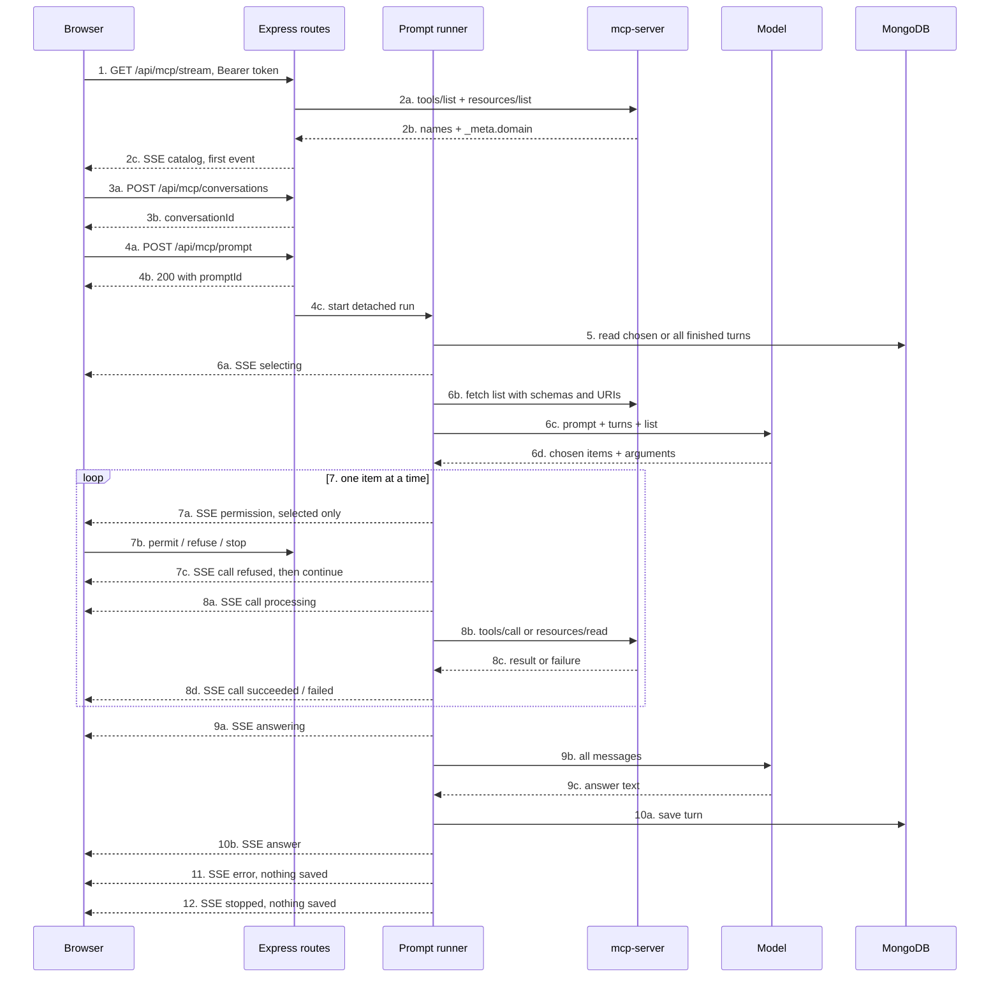

# Express MCP client implementation plan

Ticket: [docs/tickets/mcp/tkt-mcp-002-express-client.md](docs/tickets/mcp/tkt-mcp-002-express-client.md) · branch `feat/tkt-mcp-002-express-client`

There is no MCP code in `backend/src` today. The MCP server already exists and runs on the `private` Compose network ([mcp-backend](mcp-backend), service `mcp-server`), stateless JSON over `POST /mcp`, protocol `2026-07-28`. Everything below is new backend work.

## Flow

Step to section map:

- 1, 3, 4, 7b: Section 7 (HTTP surface)
- 2: Section 2 (MCP transport) + Section 7 (catalog on connect)
- 5, 10a: Section 5 (persistence)
- 6c, 9b: Section 3 (model gateway)
- 6a, 7a, 8a, 8d, 9a, 10b, 11, 12: Section 4 (event contract) + Section 6 (runtime)
- 7, 8: Section 6 (runtime)
- 11, 12: Section 6 (failure and stop paths)

## Section 1 — Config and environment

- [backend/src/config/schemas/index.ts](backend/src/config/schemas/index.ts): add `mcpServerUrlSchema`, `mongoMcpConversationsCollectionNameSchema`.
- [backend/src/config/utils/validate-common.ts](backend/src/config/utils/validate-common.ts): parse each with `parseSchema` and return them, matching the existing fail-fast style.
- [backend/src/aop/db/mongo/config/index.ts](backend/src/aop/db/mongo/config/index.ts): add an `mcpConversations` collection entry with `indexKeys: { userId: 1 }`, `unique: false`.
- `backend/.env.dev` and `backend/.env.prod`: add `MCP_SERVER_URL=http://mcp-server:3000/mcp`, `MONGO_MCP_CONVERSATIONS_COLLECTION_NAME`.

Gaps (Resolved):

- Resolved: `MCP_SERVER_URL` and `MONGO_MCP_CONVERSATIONS_COLLECTION_NAME` are required and present in the backend env files. Config is fail-fast at import, so the backend will not boot without them.
- [tests/mcp/compose.override.yml](tests/mcp/compose.override.yml) deliberately clears the backend `env_file`. The exposure test's `compose run backend` only works because it overrides the entrypoint with `node -e` and never imports `config`. Worth re-running `npm run test:mcp` after Section 1 to confirm.
- Resolved: the MCP server address is `MCP_SERVER_URL` (dev and prod: `http://mcp-server:3000/mcp`), not a constant. [exposure.md](docs/specs/architecture/http/mcp/exposure.md) still describes that address.

## Section 2 — MCP transport client (step 2, 6b, 8b)

New `backend/src/aop/mcp/client/`. No SDK needed: the server is stateless JSON, so plain `fetch` is enough. Copy the exact envelope the exposure test already proves works — see [tests/mcp/exposure.test.mjs](tests/mcp/exposure.test.mjs) lines 50-68: `Mcp-Method` and `MCP-Protocol-Version` headers plus `params._meta["io.modelcontextprotocol/protocolVersion"]`, `clientInfo`, `clientCapabilities`.

- Methods: `listTools`, `listResources`, `listResourceTemplates`, `callTool`, `readResource`. Every method takes an `AbortSignal` so stop can cancel in-flight work (FR-MCP-STP-004).
- Validate each response with Zod through `parseSchema`; failure throws `SchemaValidationException`.
- Domain for each item comes from `_meta.domain` (see [mcp-backend/src/modules/whatsapp/index.ts](mcp-backend/src/modules/whatsapp/index.ts)). Keep a `{ domain, name } -> uri` map built from `resources/list` so a prompt's `{ domain, name }` resource choice resolves to a URI for `resources/read`.
- A JSON-RPC `error` response, a non-200, or a connection failure is a server failure, surfaced to the runner for the `error` event (HTTP-MCP-FLR-002).

Gaps:

- Resolved: the `chat` resource template in [mcp-backend/src/modules/whatsapp/index.ts](mcp-backend/src/modules/whatsapp/index.ts) carries `_meta.domain`. The client requires that field on templates and on concrete resources. The `{ domain, name }` to URI map is built only from `resources/list`.
- Resolved: `FR-MCP-EXP-003` was never defined. The citations on [HTTP-MCP-EXP-001/002/003](docs/specs/architecture/http/mcp/exposure.md) and on the ticket were stale. Exposure stays on `FR-MCP-EXP-001` and `FR-MCP-EXP-002` (public cases also cite `NFR-SEC-MCP-002`). [TKT-MCP-001](docs/tickets/mcp/tkt-mcp-001-private-network.md) owns those three scenarios; this ticket only traces `FR-MCP-EXP-001` and `HTTP-MCP-EXP-001` for the client call.

## Section 3 — Model gateway (steps 6c, 9b)

New `backend/src/aop/mcp/model/`. Two model calls per prompt:

1. Selection and arguments: prompt + context turns + the MCP list. Returns which not-attached items are relevant and the arguments for every item (attached and selected). Covers FR-MCP-SEL-002, FR-MCP-SEL-006, FR-MCP-ARG-001.
2. Answer: all accumulated messages, including tool and resource results.

Both calls pass the run's `AbortSignal`. Any non-200, malformed output, or network failure ends the prompt as a provider failure.

## Section 4 — Event contract (steps 6a, 7a, 7c, 8a, 8d, 9a, 10b, 11, 12)

The emitter validates every event against an exhaustive schema map, so MCP events must be registered in three places.

- [backend/src/shared/constants/events/index.ts](backend/src/shared/constants/events/index.ts): add an `mcp` group whose values are the exact wire `type` strings from [prompt.md](docs/specs/architecture/http/mcp/prompt.md): `catalog`, `selecting`, `permission`, `call`, `answering`, `answer`, `error`, `stopped`.
- New `backend/src/shared/schemas/mcp/events/` and `backend/src/shared/types/mcp/events/`: one Zod schema per event with exactly the fields each acceptance scenario lists (`call` carries `status`, `domain`, `name`, `kind`, `arguments`, and `result` only when `succeeded`; `answer` carries `content`, `startedAt`, `finishedAt`, `domains`, `list`, `messages`).
- Extend `EventTypeToPayloadMap` and the `eventSchemas` map in [backend/src/aop/emitter/schemas/index.ts](backend/src/aop/emitter/schemas/index.ts).

Each emitted payload also needs internal `userId` and `promptId` for stream filtering.

Gaps and decisions:

- `EventTypeToPayloadMap` currently lives at [backend/src/shared/types/jobs/events/types-jobs-events.ts](backend/src/shared/types/jobs/events/types-jobs-events.ts) and is imported by `sendSSE`. Adding MCP keys to a jobs-named file is awkward. Decision: move the map to `shared/types/events/` (touches a handful of imports) or add MCP keys in place.
- `sendSSE` serializes the whole emitter payload, so the internal `userId` would leak to the browser and `catalog` would gain a `promptId` it must not have. Add a small mapper in `modules/mcp/mappers/` from emitter payload to wire event, and send the mapped object. The jobs stream does not do this today, so this is new behaviour rather than a pattern to copy.

## Section 5 — Persistence (steps 5, 10a)

- New repository `backend/src/aop/db/mongo/repository/mcp/` plus a Zod document schema, following the `database-query-patterns` skill: `parseSchema` on every read, `SchemaValidationException` on mismatch.
- Document shape: `{ _id, userId, turns: [{ turnId, prompt, answer, savedAt }] }`.
- Methods: `create`, `listForUser`, `getByIdForUser`, `deleteForUser`, `appendTurn`.
- Register it on `DbContext` ([backend/src/aop/db/mongo/context](backend/src/aop/db/mongo/context)) so controllers reach it via `req.context.db.repository.mcp`. The runner builds its own context the way `Delegator.dbContext()` does, since it runs after the HTTP response.
- Only a finished answer becomes a turn (HTTP-MCP-CNV-004); `stopped` and `error` save nothing (HTTP-MCP-CNV-005).

Gap: conversation CRUD ([HTTP-MCP-CNV-001](docs/specs/architecture/http/mcp/conversation.md) through `CNV-006`) is not in TKT-MCP-002's definition of done, and no other ticket covers it. But `HTTP-MCP-PRG-007` requires a `conversationId` created by `CNV-001`, `HTTP-MCP-OWN-002` requires the 404 masking on it, and `CTX-001/002` require saved turns. Decision needed: fold create/list/read/delete into this slice (this plan assumes yes, since the prompt endpoint is untestable without it) or split out a TKT-MCP-003 and stub conversations here.

## Section 6 — Prompt runtime (steps 4c, 6, 7, 8, 9, 10, 11, 12)

New `backend/src/aop/mcp/runner/`, a singleton modelled on [backend/src/aop/delegator/index.ts](backend/src/aop/delegator/index.ts).

State:

- `activePrompts: Map<promptId, PromptRun>` where a run holds `userId`, `conversationId`, `state`, `startedAt`, `aborter`, `messages`, and `pendingPermission`.
- `byConversation: Map<conversationId, promptId>` to reject a second prompt in a busy conversation (HTTP-MCP-PRG-008, FR-MCP-CNV-004). "Busy" includes waiting on permission.

Orchestration, after the controller has already responded 200:

1. Load context turns (`turnIds` or all finished turns) and seed `messages` oldest first, each old prompt as `user` and its answer as `assistant`, then the new prompt as `user` (HTTP-MCP-CTX-001/002).
2. Emit `selecting`, fetch the MCP list, keep it as `list` (not a message), call the model for selections and arguments with the conversation messages and that list.
3. Walk the resulting items strictly one at a time (HTTP-MCP-ORD-001). Attached items run with no ask (SEL-001). A selected item emits `permission` and parks on a deferred promise with no timer (SEL-002, SEL-003, SEL-007, NFR-REL-MCP-001).
4. On permit: emit `call` `processing`, invoke the MCP server with the abort signal, then `succeeded` with `result` or `failed`, and append the outcome to `messages` with role `tool` or `resource`. A failure continues to the next step (FLR-001).
5. On refuse: emit `call` `refused` with `arguments` and no `result`, never `processing`, and continue (SEL-006, SEL-009).
6. Emit `answering`, call the model for the answer, emit `answer` with `content`, `startedAt`, `finishedAt`, `domains` filtered to what was used, `list`, and `messages`; then append the turn.
7. Provider or server failure: emit `error` with a non-empty `context`, `messages`, and `list` when the model asked for it; no `answer`, nothing saved.
8. Stop: abort the signal, emit a single `stopped` with `messages` and `list` when the model asked for it; no later `call`, `selecting`, `permission`, `answering`, or `answer` (STP-001).

Cross-cutting rules:

- Ownership: `permit`, `refuse`, and `stop` resolve the run and compare `userId` against `req.context.user.id`; a mismatch or unknown id throws `ResourceNotFoundException`, which the exceptions middleware renders as 404 `NOT_FOUND_ERROR` (HTTP-MCP-OWN-001).
- The pending permission lives in the registry, not the stream, so closing the stream leaves the run alive and a later stream can replay the open ask after the catalog (HTTP-MCP-PRG-009).

Gaps and decisions:

- `HTTP-MCP-STP-002` requires 422 for this user's prompt that is *not* being answered, while `HTTP-MCP-OWN-001` requires 404 for an unknown id. A finished prompt removed from `activePrompts` becomes indistinguishable from unknown and would return 404 instead of 422. Decision needed: keep finished prompts in a bounded registry entry (suggested, e.g. terminal state retained with its `userId`) or persist a `promptId -> userId` record.
- `HTTP-MCP-PRG-007` requires each `turnId` to be a finished turn of that conversation, but no scenario defines the response for an invalid `turnId`. 422 `BUSINESS_LOGIC_ERROR` is the consistent choice; the spec should say so.
- `Aborter` currently lives at [backend/src/aop/delegator/aborter/index.ts](backend/src/aop/delegator/aborter/index.ts) and is documented as "owned by Delegator". Reuse it from there or lift it to a shared `aop/aborter`; lifting is cleaner but touches the delegator.

## Section 7 — HTTP surface (steps 1, 2c, 3, 4a, 4b, 7b)

New module `backend/src/modules/mcp/` following the structure in [backend/.agents/rules/architecture.mdc](backend/.agents/rules/architecture.mdc): `mcp-routing.ts`, `mcp-controller.ts`, `mcp-middleware.ts`, `mcp-registry.ts`, plus `schemas/`, `types/`, `mappers/`.

- [backend/src/shared/constants/routes/index.ts](backend/src/shared/constants/routes/index.ts): add an `mcp` group under `/api/mcp` for `stream`, the four conversation routes, `prompt`, `prompt/:id/permit`, `prompt/:id/refuse`, `prompt/:id/stop`.
- [backend/src/server/index.ts](backend/src/server/index.ts): mount `mcpRoutes` after `http.context.middleware.authenticate` and before `exceptionsMiddleware()`, alongside `jobsRoutes`.
- `streamMcp`: `openSSE(res)`, send `catalog` first, replay an open `permission` for this user's active prompt, register one listener per MCP event type filtered by `event.userId === req.context.user.id`, and tear every listener down in `req.on('close', ...)`. Follow the `sse-streaming` skill and the `streamJobs` precedent.
- Mutating controllers respond with the inline envelope used elsewhere: `{ success: true, data: { promptId }, meta: { timestamp: new Date().toISOString() } }`.
- `mcp-middleware.ts`: body validation through `validateRequestPayload`; a tool or resource outside the catalog, a busy conversation, and a non-matching permit/refuse body all throw `BusinessLogicException` (422, `BUSINESS_LOGIC_ERROR`); unknown or other-user prompt and conversation ids throw `ResourceNotFoundException` (404).
- `mcp-registry.ts` registered in [backend/src/services/openapi/generate-spec.ts](backend/src/services/openapi/generate-spec.ts).

Gap: the `sse-streaming` skill requires the stream controller to be synchronous, but the catalog needs an awaited MCP round trip. Decision needed: cache the catalog in the MCP client and refresh it out of band so the handler can send a cached value synchronously (suggested, also avoids one MCP call per connection), or make this one handler `async` after `openSSE(res)` and accept the deviation.

## Section 8 — Tests

- Unit (vitest) in `backend/src/modules/mcp/tests/` and alongside `aop/mcp/**`: the request envelope and response parsing for the transport client, the runner state machine (permission gate, one-at-a-time, refuse-then-continue, stop), and the stream controller with `openSSE`/`sendSSE` mocked the way [backend/src/modules/jobs/tests/jobs-controller-stream-jobs.test.ts](backend/src/modules/jobs/tests/jobs-controller-stream-jobs.test.ts) does.
- Integration in `backend/test/integration/mcp/`, using [backend/test/integration/harness.ts](backend/test/integration/harness.ts) and the SSE reader at [backend/test/integration/jobs/sse/index.ts](backend/test/integration/jobs/sse/index.ts). Cover the ticket's definition of done: `PRG-001` to `PRG-009`, `AVL-001/002`, `SEL-001` to `SEL-007`, `ORD-001`, `FLR-001/002`, `REC-001` to `REC-003`, `ARG-002`, `CTX-001/002`, `STP-001/002`, `OWN-001`.
- `EXP-001` to `EXP-003` are already covered by [tests/mcp/exposure.test.mjs](tests/mcp/exposure.test.mjs) under TKT-MCP-001; leave that suite alone apart from re-running it after Section 1.

Gap: the backend test suite has no fixture for stubbing outbound HTTP, and integration tests must not call a real model provider or require a running `mcp-server`. Decision needed: make the MCP client and model gateway injectable (constructor or context seam) so tests can pass fakes, or stand up a local stub HTTP server in the harness and point `MCP_SERVER_URL` at it. The injectable seam is lighter but conflicts slightly with the singleton style used by `Delegator` and `Emitter`.