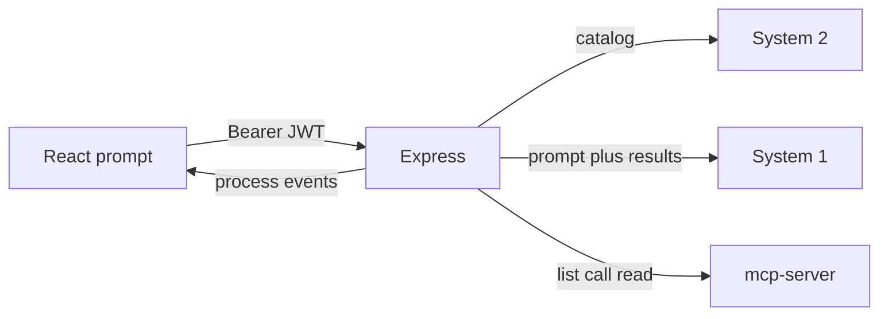

# Private MCP integration

Express calls System 2, System 1, and the MCP harness. The React app calls Express with the existing Bearer JWT. System 2 plans and chooses tools. System 1 writes the reply in one pass.

System 2 returns the tool calls for the prompt. One approval covers that set. Express runs the calls, then System 1 returns the reply. The page receives `tool-invocation`, `tool-result`, and `tool-finished` for each call, then that reply.

## Order

Write the FR and the HTTP and client acceptance, then the Express module, then Orval types, then the page. Copy the jobs module shape, [openSSE](backend/src/aop/http/sse/index.ts) and [sendSSE](backend/src/aop/http/sse/index.ts), [rest.ts](frontend/src/api/service/client/rest.ts), and the frontend SSE client.

## 1. MCP server

Copy [mcp-server-harness](file:///Users/ghr/Desktop/root/repositories/mcp-server-harness) into `mcp-server/` (source, Dockerfile, docs, tests; omit `.git`, `node_modules`, `.env`). Keep `responseMode: "json"` and `legacy: "reject"`.

`backend` and `mcp-server` share a Compose network in [docker-compose.dev.yml](docker-compose.dev.yml) and [docker-compose.prod.yml](docker-compose.prod.yml). Compose sets `HOST=0.0.0.0` and `MCP_ALLOWED_HOSTS=mcp-server,127.0.0.1,localhost`. Host runs use `HOST=127.0.0.1`.

## 2. Express

The pending turn lives in a process-local `Map` keyed by user id and turn id. The value is the stage (`select` or `answer`), the message list, and, during `select`, the tool calls waiting for approval.

Client in `backend/src/aop/mcp/` via `@modelcontextprotocol/client` at the same major as `@modelcontextprotocol/server` v2. One client per call. Methods: `tools/list`, `tools/call`, `resources/list`, `resources/templates/list`, `resources/read`. Each call sends `Accept: application/json, text/event-stream`.

- `application/json` maps to one `tool-result`.
- `text/event-stream` maps to one `tool-result` per chunk.

Both are wrapped with `tool-invocation` and `tool-finished`. Those three events share `callId`, `name`, and `kind` (`tool` or `resource`). The event union is separate from the jobs event map. A new step is a schema variant, an emitter call, and a page renderer.

Both model calls are `POST ${BASE_URL}/chat/completions` with `Authorization: Bearer ${API_KEY}`.

System 2 receives `{ model, messages, tools }`. Each allowlisted MCP tool is a function tool: `name`, `description`, and `parameters` from its input schema. Each allowlisted resource is a function tool whose `parameters` are `{ uri }`. `message.tool_calls` is the approval set, stored with stage `select`. An empty `tool_calls` list moves the turn to `answer`.

System 1 receives `{ model, messages }`. After tools finish, `messages` includes the prompt and each tool result. `message.content` is the reply.

Env in [backend/src/config/schemas/index.ts](backend/src/config/schemas/index.ts): `MCP_URL` (`http://mcp-server:3000/mcp` in Compose), `MCP_ALLOWED_TOOLS`, `MCP_ALLOWED_RESOURCES`, `SYSTEM_2_BASE_URL`, `SYSTEM_2_API_KEY`, `SYSTEM_2_MODEL`, `SYSTEM_1_BASE_URL`, `SYSTEM_1_API_KEY`, `SYSTEM_1_MODEL`. A call runs when its name or URI is on the allowlist and on the stored turn.

Module `backend/src/modules/mcp/`, mounted in [backend/src/server/index.ts](backend/src/server/index.ts) after `authenticate`. JSON responses use `{ success: true, data }`.

- `POST /api/mcp/turns` — `{ prompt }`. Calls System 2. Returns the approval set, or System 1's reply when System 2 returns no tool calls.
- `POST /api/mcp/turns/:id/allow` — SSE for the stored requests, then System 1's reply.

## 3. Frontend

Prompt page behind `Authenticate` in [frontend/src/components/routing/routes/Routes.tsx](frontend/src/components/routing/routes/Routes.tsx). The approval notice lists that turn's requests. The process list appends events and renders them by `type`.

## 4. Docs

FR for the prompt, the single approval, and the three process events. HTTP acceptance for both routes, for an allow of the stored turn, and for one `tool-result` and for several before `tool-finished`. Client acceptance for a direct reply, the approval notice, and the process list.
