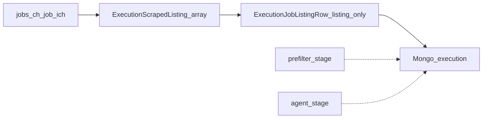

# Scraper output refactor: `ExecutionScrapedListing` + pipeline row

## Goal

Replace the current scrape result shape ([`executionScraperPageContentSchema` + `executionScraperTargetResultSchema`](backend/src/shared/schemas/jobs/tools/execution/schemas-execution-scraper-tool.ts)) with execution-domain types:

1. **`ExecutionScrapedListing`** — only what portal targets produce (`ok` / fail discriminant). No execution timestamps, no LLM/prefilter fields.
2. **`ExecutionJobListingRow`** — persisted unit per listing: `{ listing: ExecutionScrapedListing; prefilter?: …; match?: … }`. Optional stages stay **omitted** until implemented; the shape exists now to avoid a second migration.

## Schema design (Zod + OpenAPI)

All of this lives in the **execution** tooling domain alongside existing scraper execution schemas (e.g. extend [`schemas-execution-scraper-tool.ts`](backend/src/shared/schemas/jobs/tools/execution/schemas-execution-scraper-tool.ts) or a sibling such as `schemas-execution-job-listing-row.ts` that is clearly execution-scoped, not a generic “jobs” model).

- **`executionScrapedListingSchema`** (OpenAPI: `ExecutionScrapedListing`): `z.discriminatedUnion('ok', [...])`
    - `ok: true`: `listingKey`, `source` (`jobs-ch` | `job-ich`), `url`, `title`, `text`, `fields` optional (`record`), `postedAt` optional/nullable.
    - `ok: false`: `listingKey`, `source`, `url`, `error` (`code` + `message`).
- **`executionJobListingRowSchema`** (OpenAPI: `ExecutionJobListingRow`):
    - `listing: executionScrapedListingSchema`
    - `prefilter`: optional object — start with `passed: boolean`, `reasonCodes: string[]` (or `.optional()` entirely until stage exists).
    - `match`: optional object — placeholder or omit in Zod until agent work lands; if included, reserve `verdict`, `confidence`, `rationale` + `schemaVersion` for criteria/evaluator.
- **`results`** on [`executionScraperToolTargetSchema`](backend/src/shared/schemas/jobs/tools/execution/schemas-execution-scraper-tool.ts): `z.array(executionJobListingRowSchema)` instead of `z.array(executionScraperTargetResultSchema)`.

**Remove or stop exporting** old OpenAPI types (`ExecutionScraperPageContent`, nested descriptions/informations) once nothing references them — reduces `allOf` churn you were already avoiding with `.shape` spreads.

**Types**: update [`types-execution-scraper-tool.ts`](backend/src/shared/types/jobs/tools/execution/types-execution-scraper-tool.ts) to infer `ExecutionScrapedListing`, `ExecutionJobListingRow`; drop exports tied to deleted schemas.

## Helpers (minimal shared surface)

Markup and DOM structure differ per portal, so **most “Playwright extraction → `text` / `title` / `fields`” logic should stay inside each target** (or small target-private modules). A single shared `flattenListingText(descriptions, informations)` is **not** assumed viable: those intermediate shapes are target-specific and may disappear as targets emit `ExecutionScrapedListing` directly.

What **does** belong in shared, testable code:

- **`listingKeyFrom(source, url)`** — stable key from normalized URL + source (used for idempotency and error rows when URL is known).
- **`MAX_LISTING_TEXT_CHARS`** (or equivalent) — one execution-domain constant so BSON bounds and any future LLM prompt budget can reference the same number; **apply the cap inside each target** (or a target helper) when assigning `text`, since only the target knows how to truncate without destroying structure.

Optional: tiny shared utilities that are **not** tied to a specific DOM (e.g. `normalizeListingUrl`, `truncateUtf8Safe`) if multiple targets need identical behavior — add only when the second target needs the same implementation.

## Listing text cap (BSON + future LLM)

**Do not rely on “remember to align” in the Risks section only.** Track it in two places:

1. **Code (source of truth for the number)** — One shared constant (e.g. under `backend/src/shared/constants` or an execution-scraper constants module). Each target’s text builder **must** enforce this cap when setting `ExecutionScrapedListing.text`; any future agent prompt builder **must** import the same value (or a derived cap documented next to it) so scrape persistence and LLM input stay in sync.
2. **Doc (source of truth for the reasoning)** — Add a short subsection to [`docs/job-pipeline-plan.md`](docs/job-pipeline-plan.md): state the chosen cap, that it bounds Mongo `text` size per listing, and a **rough budget** line for LLMs (e.g. system + criteria + one listing `text` + JSON output reservation vs typical context window). When you change default model, multi-listing batches, or prompt size, **update this subsection** and bump the constant if needed.

Optional later: read cap from env (`LISTING_TEXT_MAX_CHARS`) with the constant as default, so ops can tighten without redeploying code — only if you need that; not required for the first refactor.

## Target refactor

- [`jobs-ch/index.ts`](backend/src/aop/delegator/tools/scraper/targets/jobs-ch/index.ts) and [`job-ich/index.ts`](backend/src/aop/delegator/tools/scraper/targets/job-ich/index.ts): `run()` returns **`Promise<ExecutionScrapedListing[]>`** (not rows). On each detail success build `ok: true` with target-local formatting for `text`/`title`/`fields`; on nav/scrape failure build `ok: false` with `listingKey` if URL known.
- Remove intermediate types that only served the old `ExecutionScraperPageContent` if unused elsewhere.

## Scraper orchestrator

- [`ScraperTarget.run` in types](backend/src/aop/delegator/tools/scraper/types/index.ts): return type `Promise<ExecutionScrapedListing[]>`.
- [`scraper/index.ts`](backend/src/aop/delegator/tools/scraper/index.ts): for each target’s listings, map to **`ExecutionJobListingRow`**: `{ listing }` only (no `prefilter`/`match`). Pass `results` to `onTargetFinish` in the shape OpenAPI expects.

This keeps listing extraction in targets and the **execution** envelope consistent at the persistence boundary.

## Delegator / repository

- [`Delegator.getToolTargetsWithResults`](backend/src/aop/delegator/index.ts): no structural change if `ExecutionToolTarget` still validates through updated Zod.
- [`JobRepository.addExecution`](backend/src/aop/db/mongo/repository/jobs/index.ts): unchanged if execution still matches `jobDocumentSchema` after schema update.

**DB**: assume a clean wipe (or empty jobs collection) before deploy; all persisted executions use the new `ExecutionJobListingRow` shape only—no backward compatibility for old `results` blobs.

## OpenAPI, Orval, frontend

- Regenerate OpenAPI + [`frontend/src/_types/_gen`](frontend/src/_types/_gen).
- Update [`ScraperTarget.tsx`](frontend/src/components/pages/jobs/components/jobDetailSheet/execution/toolPanel/scraper/ScraperTarget.tsx) (and any row types): read `row.listing` (`ok`, `title`, `url`, `error`); optionally show `prefilter`/`match` columns when present later.

## Tests

- Backend: update fixtures to `ExecutionJobListingRow` where executions are stubbed ([`jobs-controller` tests](backend/src/modules/jobs/tests), delegator/scraper tests if present).
- Add unit tests for `listingKeyFrom` and Zod round-trip for `executionScrapedListingSchema` / `executionJobListingRowSchema`.
- Per-target tests for `text`/`title` shaping as needed (markup-specific; not forced into a fake “shared flatten” helper).

## Phasing

| Phase | Scope                                                                                                                                                                    |
| ----- | ------------------------------------------------------------------------------------------------------------------------------------------------------------------------ |
| **1** | Zod + types: `ExecutionScrapedListing`, `ExecutionJobListingRow` with only `listing` required; `prefilter`/`match` optional stubs or omitted from OpenAPI until needed    |
| **2** | `listingKeyFrom` + cap constant + both targets (local formatters) + scraper wrap + remove old schemas                                                                    |
| **3** | OpenAPI/Orval + frontend table                                                                                                                                           |
| **4** | Later: prefilter fills `prefilter`; agent fills `match` without changing `ExecutionScrapedListing`                                                                       |

## Risks

- **BSON size**: mitigated by the shared cap in [Listing text cap (BSON + future LLM)](#listing-text-cap-bson--future-llm); oversized executions still possible from *many* listings—monitor document size if needed.
- **Discriminated union in OpenAPI/Orval**: verify generated TS matches `ok` discriminator (adjust `z.discriminatedUnion` / `.openapi` if Orval emits awkward unions).
