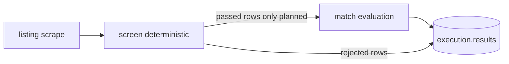

# Scraper match step

The **match** step is the optional third stage on each scraper pipeline row: after a listing is **scraped** and **screened**, an evaluator (planned: LLM-backed) decides how well the job fits user-defined criteria and writes structured verdict fields on the same row.

Today the scraper orchestrator only populates `listing` and `screen`. The `match` object is **reserved in the schema** but **not produced by any backend module yet**.

## Position in the pipeline



| Stage | Producer | Input | Output on row |
|-------|----------|-------|----------------|
| Scrape | Portal target (`jobs-ch`, `job-ich`) | Search keywords, `maxPages` | `listing` |
| Screen | `Scraper.buildScreen` | `listing` + merged keywords | `screen.passed`, `screen.reasonCodes` |
| Match | *Not implemented* | `listing` (+ job criteria) | `match.verdict`, `match.confidence`, `match.rationale`, `match.schemaVersion` |

Screening is cheap and deterministic; matching is expected to be slower and model-dependent, so it should run only on rows that passed the screen (and ideally only on `listing.ok === true` successes).

## Schema contract

Defined in [`schemas-execution-scraper-tool.ts`](../../../shared/schemas/jobs/tools/execution/schemas-execution-scraper-tool.ts):

```ts
match?: {
  verdict?: string;       // e.g. fit / partial / no-fit — exact enum TBD
  confidence?: number;    // 0–1 or model-specific scale TBD
  rationale?: string;     // Short explanation for UI and audit
  schemaVersion?: string; // Prompt/output contract version for replays
}
```

Each `results[]` entry is an `ExecutionScraperToolTargetResult`:

```ts
{
  listing: ExecutionScraperToolTargetListing;
  screen?: ExecutionScraperToolTargetScreen;
  match?: ExecutionScraperToolTargetMatch;
}
```

Generated client types mirror this (`ExecutionJobItemMatch` in the frontend Orval output). The job detail UI does not render match fields yet.

## Intended behaviour (design)

These rules describe the **target** behaviour for a future implementation; they are not enforced in code today.

### Inputs

- **Listing body:** `listing.title`, `listing.text`, optional `listing.fields` and `postedAt` for successful scrapes.
- **Criteria:** Job-level evaluation criteria (storage shape and API surface to be defined with the jobs module — not part of the scraper tool config today).
- **Context budget:** Listing `text` is capped at 32_000 characters at scrape time so a single-row match call stays within typical model context when combined with system prompt, criteria, and JSON output.

### Processing

1. Select candidate rows: `screen?.passed === true` and `listing.ok === true`.
2. Build a prompt from criteria + listing snapshot (version tracked via `schemaVersion`).
3. Call the evaluator (LLM or rules engine).
4. Parse structured output into `match` and attach it **on the same row** without mutating `listing` or `screen`.

Failed scrapes and screen rejections should **omit** `match` (or leave it unset) so summaries and UI can treat “no match” as “not evaluated.”

### Outputs

| Field | Purpose |
|-------|---------|
| `verdict` | Primary user-facing label for sorting/filtering |
| `confidence` | Optional score for ranking or thresholds |
| `rationale` | Human-readable justification |
| `schemaVersion` | Allows changing prompts/enums without breaking historical executions |

Downstream consumers (Mongo execution blob, SSE patches, frontend table) read the same row shape; adding `match` should not require reshaping `listing`.

## Where implementation will live

Recommended split (aligns with [scraper pipeline refactor plan](../../../../../.cursor/plans/scraper_pipeline_row_refactor_5b6691c4.plan.md)):

| Concern | Location |
|---------|----------|
| Scrape + screen | [`scraper/index.ts`](../../../aop/delegator/tools/scraper/index.ts) (today) |
| Match evaluation | New module, e.g. `aop/delegator/tools/scraper/match/` or a post-scraper job step invoked by the delegator after scraper tools complete |
| Persistence | Unchanged — delegator merges enriched `results` into `ExecutionPayload` |
| API / OpenAPI | Extend execution schemas only when match fields are stable; regenerate Orval |

**Not** in portal targets: `jobs-ch` / `job-ich` should remain DOM extraction only.

## Execution flow options

Two integration patterns are compatible with the current delegator:

1. **Inline after screen** — `Scraper.execute` (or a wrapper) runs match before `onTargetFinish`. Simpler, but couples scrape latency to model latency.
2. **Separate tool step** — Delegator runs scraper, then a `match` tool or internal pass over the execution document. Better for retries, rate limits, and swapping models without re-scraping.

Until a choice is made, treat match as a **logical** stage on the row, not a deployed service.

## Observability and summaries

Today `summary.passed` / `summary.rejected` count **screen** outcomes only. When match exists, product rules may need:

- A separate histogram for verdicts (e.g. `verdictCounts`), or
- Extended summary fields on `ExecutionScraperToolTarget`

Document any new summary fields in [scraper.md](./scraper.md) when implemented.

## Testing (planned)

When match is implemented, tests should assert **effects** on persisted rows, not prompt internals:

- Screen-failed row → no `match`.
- Screen-passed row → `match` present with required fields for the active `schemaVersion`.
- Invalid model JSON → structured error on row or target, without corrupting `listing`.

Follow the style of [`scraper.test.ts`](../../../aop/delegator/tools/scraper/scraper.test.ts) (mock evaluator, assert `onTargetFinish` / execution payloads).

## Related docs

- [Scraper tool](./scraper.md) — scrape, screen, targets, and current execution shape.
- Pipeline row refactor notes: [`.cursor/plans/scraper_pipeline_row_refactor_5b6691c4.plan.md`](../../../../../.cursor/plans/scraper_pipeline_row_refactor_5b6691c4.plan.md)
