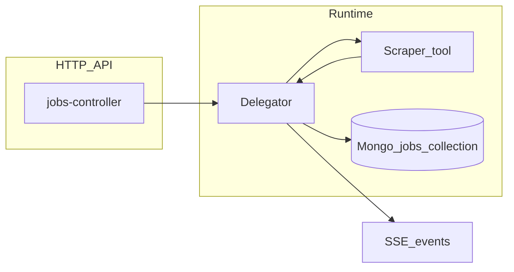
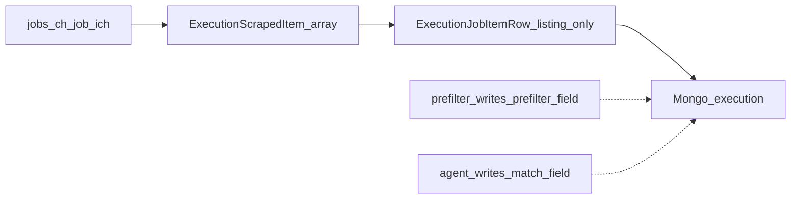

# Job-matching pipeline improvement plan

## 1) Current data flow and schema (as implemented)

**Configuration (“target” today = portal + scrape params, not career criteria)**

- Scraper tools are defined in [backend/src/shared/schemas/jobs/tools/schemas-tools-scraper.ts](backend/src/shared/schemas/jobs/tools/schemas-tools-scraper.ts): `targets` (`jobs-ch` | `job-ich`), optional per-target `keywords` / `maxPages`, tool-level defaults.
- Cross-field validation (keywords/tool vs target) lives in [backend/src/modules/jobs/validators/jobs-validators.ts](backend/src/modules/jobs/validators/jobs-validators.ts).
- Create/update API shapes: [backend/src/modules/jobs/schemas/index.ts](backend/src/modules/jobs/schemas/index.ts); frontend maps forms in [frontend/src/components/pages/jobs/components/jobSheet/mappers/index.ts](frontend/src/components/pages/jobs/components/jobSheet/mappers/index.ts).

**Scrape → results (execution-domain pipeline row)**

- [backend/src/aop/delegator/index.ts](backend/src/aop/delegator/index.ts): `delegate()` generates `executionId`, runs **tools sequentially** via [backend/src/aop/delegator/tools/index.ts](backend/src/aop/delegator/tools/index.ts), emits SSE events (`targetFinished`, `jobFinished`, …) per [backend/src/shared/schemas/jobs/events/schemas-events.ts](backend/src/shared/schemas/jobs/events/schemas-events.ts), then `persistResult()` → `JobRepository.addExecution`.
- Scraper: [backend/src/aop/delegator/tools/scraper/index.ts](backend/src/aop/delegator/tools/scraper/index.ts) runs targets concurrently; merges tool-level and target-level `keywords` / `maxPages` via [backend/src/aop/delegator/tools/scraper/mappers/index.ts](backend/src/aop/delegator/tools/scraper/mappers/index.ts).
- Persisted scrape shape lives in execution tooling Zod/OpenAPI ([backend/src/shared/schemas/jobs/tools/execution/schemas-execution-scraper-tool.ts](backend/src/shared/schemas/jobs/tools/execution/schemas-execution-scraper-tool.ts)):
  - **`ExecutionScraperToolTarget`** — `results` is **`ExecutionJobItemRow[]`** (not the former `{ result, error }` envelope).
  - **`ExecutionJobItemRow`** (`executionJobItemRowSchema`, OpenAPI `ExecutionJobItemRow`): **`listing`** (`ExecutionScrapedItem`), optional **`prefilter`** (`ExecutionScrapedItemPrefilter`), optional **`match`** (`ExecutionJobItemMatch`). Today only **`listing`** is filled at scrape time; **`prefilter` / `match`** are reserved for the pipeline.
  - **`ExecutionScrapedItem`** (`executionScrapedItemSchema`, OpenAPI `ExecutionScrapedItem`): **`oneOf`** success vs failure branches (Zod **`z.union`**, not **`discriminatedUnion('ok')`**, because `@asteasolutions/zod-to-openapi` fails on boolean discriminators when generating the spec).
    - **Success** (`ExecutionScrapedItemSuccess` / `executionScrapedItemSuccessSchema`): `ok`, `listingKey`, `source`, `url`, `title`, `text`, optional `fields` (`Record<string, string>`), optional `postedAt`.
    - **Failure** (`ExecutionScrapedItemFail` / `executionScrapedItemFailSchema`): `ok`, `listingKey`, `source`, `url`, `error` (`ExecutionScrapedItemError`: `code`, `message`).
- Portal targets implement **`Promise<ExecutionScrapedItem[]>`**; the orchestrator maps each item to **`{ listing }`** pipeline rows (`ExecutionJobItemRow`). Shared helpers (e.g. `listingKeyFrom`, capped body text via **`MAX_LISTING_TEXT_CHARS`** in [backend/src/aop/delegator/tools/scraper/constants/index.ts](backend/src/aop/delegator/tools/scraper/constants/index.ts)) live under the scraper tool; DOM parsing stays target-specific ([jobs-ch](backend/src/aop/delegator/tools/scraper/targets/jobs-ch/index.ts), [job-ich](backend/src/aop/delegator/tools/scraper/targets/job-ich/index.ts)).
- The old **`ExecutionScraperPageContent`** nested `descriptions` / `informations` API types are gone from OpenAPI; flat **`text`** + **`fields`** are the persisted listing surface.

**Persistence (“dashboard results”)**

- [backend/src/aop/db/mongo/repository/jobs/index.ts](backend/src/aop/db/mongo/repository/jobs/index.ts): `addExecution` **$push**es an execution onto `JobDocument.executions` ([backend/src/shared/schemas/jobs/index.ts](backend/src/shared/schemas/jobs/index.ts)).
- There is **no separate normalized listing store** and **no structured “target job criteria”** beyond scrape keywords. **No semantic filtering** after scrape—only portal keyword search plus future pipeline stages on **`ExecutionJobItemRow`**.

**Frontend**

- Executions list: [frontend/src/components/pages/jobs/components/jobDetailSheet/JobDetailSheet.tsx](frontend/src/components/pages/jobs/components/jobDetailSheet/JobDetailSheet.tsx).
- Scraper UI ([ScraperTarget.tsx](frontend/src/components/pages/jobs/components/jobDetailSheet/execution/toolPanel/scraper/ScraperTarget.tsx)): table columns **Title** and **URL** from **`results[].listing`**: successes use **`title`** / **`url`**; failures use **`error.message`** (fallback **`error.code`**) for title and **`url`** when present. Orval-generated types **`ExecutionJobItemRow`**, **`ExecutionScrapedItem`**, etc. live under [frontend/src/_types/_gen](frontend/src/_types/_gen).

---

## 2) Revised schema strategy (schema-first)

**Principles**

- **Separate concerns**: (A) _listing snapshot_ from a source (`ExecutionScrapedItem`), (B) _user criteria_, (C) _evaluation outcome_, (D) _UI projection_. Avoid stuffing unstructured LLM output into **`listing`** without versioning—use **`match`** / dedicated evaluation types with **`schemaVersion`** where needed.
- **Stable identity**: **`listingKey`** (hash of normalized URL + **`source`**) is already on success and failure variants for dedupe and cross-run joins.
- **Version everything**: `criteriaSchemaVersion`, `evaluatorPromptVersion` / `evaluatorModelId`, `listingNormalizerVersion` on persisted blobs so old executions stay interpretable.

**2.1 Canonical job listing (internal)**

- Still a plausible next Zod schema (backend-only first), e.g. **`CanonicalJobListing`**, built **from** scrape output rather than replacing **`ExecutionScrapedItem`** wholesale:
    - Align with **`listingKey`**, **`source`**, URL/title, plus **`fetchedAt`**, **`normalizedTitle`** as needed for matching.
    - **`structuredFields`**: **`ExecutionScrapedItem.fields`** already provides a permissive **`Record<string, string>`**; Canonical can narrow or remap per portal later.
    - **`textBlob`**: aligns with **`ExecutionScrapedItem.text`** — keep capped by **`MAX_LISTING_TEXT_CHARS`** (BSON + prompt budget).
    - **`raw`**: optional pointer or small debug payload **if you still want HTML-ish traces** — no longer modeled as **`ExecutionScraperPageContent`**.

**2.2 Target job criteria**

- New **`JobMatchCriteria`** (or **`JobSearchProfile`**) **not** the same as scraper keywords:
    - `mustHave` / `niceToHave` as string bullets or structured rubric items
    - constraints: location, language, seniority, employment type, salary band, industry blocklist, etc.
    - **`schemaVersion`**
- **Placement decision** (you must choose—see risks): embed on the same Mongo `Job` document **or** a sibling collection keyed by `userId` + `criteriaId` referenced from `Job`. Embedding is simpler for your current “one cron job per search” model; sibling doc scales if criteria are reused across many jobs.

**2.3 Prefilter + match (`ExecutionJobItemRow`)**

- **`ExecutionJobItemRow.prefilter`** = **`ExecutionScrapedItemPrefilter`**: deterministic stage (`passed`, **`reasonCodes`**).
- **`ExecutionJobItemRow.match`** = **`ExecutionJobItemMatch`**: extend when the agent lands (**`verdict`**, **`confidence`**, **`rationale`**, **`schemaVersion`**, …). Correlate logs with **`listingKey`** (on **`listing`**) plus run metadata you add (**`criteriaSchemaVersion`**, **`evaluatorRunId`**, etc.) — either folded into **`match`** or sibling optional fields on the row.
- Richer **`agent`** metadata (provider, latency, tokens) may live in **`match`**, adjacent row fields, or a later OpenAPI **`components`** addition—keep output **structured** (Zod / JSON schema), not free-form only.

**2.4 Dashboard projection schema**

- The API row is already **`ExecutionJobItemRow`**. Frontend can add **`prefilter` / `match`** columns (and previews) once the pipeline writes them — no parallel **`DashboardListingRow`** is strictly required unless you want a slimmer GET DTO later.
- Keep heavy payloads (long prompts, raw evidence arrays) off the default GET or behind a query flag for operators.

**2.5 Versioning and migration**

- **Breaking scrape refactor** shipped: stored executions assume **`results[]`** of **`ExecutionJobItemRow`**; legacy **`ExecutionScraperTargetResult`** payloads are obsolete for new writes.
- **Readers**: **`parseSchema`** / repository paths should tolerate **older job documents only if you deliberately retain legacy blobs** — otherwise migrations or clean loads follow your deploy rule.
- **Additive next steps**: **`prefilter` / `match`** remain optional until implemented; regenerate OpenAPI and Orval whenever those shapes change ([frontend/src/_types/_gen](frontend/src/_types/_gen)).
- **Growth risk**: executions × large **`results[]`** still pressure BSON size — align listing **`text`** caps with prompts; monitor document size (consider FK’d listings/evaluations or TTL caps).

---

## 3) Cheap pre-filter (before agent)

Run on each **successful scraped item** (or **`CanonicalJobListing`** derived from it) **deterministically**:

- **Dedupe**: drop duplicate **`listingKey`** within an execution.
- **Hard excludes** from **`fields` / title / text**: blocklisted companies, excluded title terms (case-fold + word boundaries), wrong canton/country if parseable.
- **Includes**: require at least one “must” token in **`title`** or **`text`** (optional).
- **Heuristics**: min **`text`** length; non-empty **`title`** on success rows; seniority regexes as needed.
- **Output**: write **`prefilter`** on **`ExecutionJobItemRow`** (**`passed`**, **`reasonCodes`**—aligned with **`executionScrapedItemPrefilterSchema`**); only **`passed === true`** rows feed the agent (configurable “soft fail” still visible in UI).

Implement as a pure module, e.g. `backend/src/aop/job-matching/prefilter/` with unit tests (no network).

---

## 4) Generic agent API layer

**Location**: e.g. `backend/src/aop/llm/` (no LLM deps in repo today — greenfield).

- **`AgentInvocation` contract** (stable):
    - Input: `task` enum or string id (`listing_match_v1`), `messages` or `promptParts`, `responseFormat: { type: 'json_schema', schemaId, zodSchema }`, `constraints: { maxOutputTokens, temperature }`, `correlation: { executionId, listingKey }`
    - Output: `{ content: unknown (parsed) | string, usage, provider, model, latencyMs, raw? }` + typed errors (`RateLimit`, `Timeout`, `InvalidResponse`)
- **Providers**: interface **`LlmProvider`** with implementations: HTTP OpenAI-compatible (covers many hosts), Anthropic, **local** via base URL (Ollama, LM Studio). Select via config: `LLM_PROVIDER`, `LLM_BASE_URL`, `LLM_API_KEY`, `LLM_MODEL`.
- **Local models**: same contract; optionally force `maxConcurrency=1` and lower token limits in config.
- **Parsing**: validate agent JSON against Zod for verdict-shaped output; map into **`ExecutionJobItemRow.match`** (extend **`ExecutionJobItemMatch`** as needed); on failure retry once or record **`errors`**.

---

## 5) Delegator integration: recommendation

**Recommend: hybrid — context-mapped pipeline service invoked from Delegator after the scraper produces targets, not a new “portal target”.**

| Approach | Fit here |
| --- | --- |
| **New Delegator “tool”** | Awkward: tools mirror **external integrations** (browser scrape, email). An LLM “target” would fake the same shape as `jobs-ch` / `job-ich` and overload [toolRegistry](backend/src/aop/delegator/tools/index.ts). |
| **Tool call** (LLM as callable tool inside another agent) | Useful later for multi-step agents; **unnecessary** for “one structured classification per listing”. |
| **Context service + Delegator hook** | **Best fit**: inject **`JobMatchPipeline`** — after scraper **`ExecutionJobItemRow[]`** is assembled ( **`getToolTargetsWithResults`** for a scraper tool), normalize if needed → prefilter → batch agent → **merge** **`prefilter` / `match`** onto existing rows **before** **`persistResult`**. Keeps [Scraper](backend/src/aop/delegator/tools/scraper/index.ts) focused on **`ExecutionScrapedItem`** emission, centralizes feature flags, and preserves SSE semantics (optional progress events per batch). |

Wire injection similarly to [backend/src/aop/http/middleware/context/delegator-context.ts](backend/src/aop/http/middleware/context/delegator-context.ts): pass pipeline into `Delegator` construction or resolve from a small app container **if** you later need testing seams (today singleton [Delegator.getInstance](backend/src/aop/delegator/index.ts)).

---

## 6) Phased implementation (high-level)

1. **Architecture**: Document end-to-end flow (scrape → optional normalize → prefilter → agent → persist → SSE/UI); decide criteria placement and document size limits.
2. **Interfaces**: Zod schemas for optional **`CanonicalJobListing`**, **`JobMatchCriteria`**, evolved **`ExecutionScrapedItemPrefilter`** / **`ExecutionJobItemMatch`** (and optional extra row/metadata fields); **`LlmProvider`** / **`AgentClient`** types.
3. **Normalization**: Portal-specific enrichment from **`ExecutionScrapedItem`** (especially **`fields`**, **`text`**) → **`CanonicalJobListing`** if you need more than scrape persistence already carries ([jobs-ch](backend/src/aop/delegator/tools/scraper/targets/jobs-ch/index.ts) / [job-ich](backend/src/aop/delegator/tools/scraper/targets/job-ich/index.ts)).
4. **Prefilter**: Implement + tests; write **`prefilter`** on **`ExecutionJobItemRow`** from criteria + env defaults.
5. **Agent layer**: One provider first (e.g. OpenAI-compatible); add second for redundancy; local base URL path.
6. **Pipeline**: **`JobMatchPipeline.runForExecutionTool(scraperExecutionTool, criteria, flags)`** after scrape results exist; merge into rows; validate with **`executionJobItemRowSchema`** (and extended **`match`** if you evolve it).
7. **Persistence**: Monitor BSON size (`results[].listing.text`, many rows); embed evaluation on **`ExecutionJobItemRow`** first; extract to FK collections if migrations require.
8. **API/OpenAPI**: Extend **`ExecutionJobItemMatch`** / **`ExecutionScrapedItemPrefilter`** (or sibling schemas) when agent output grows; regenerate Orval.
9. **Frontend**: Add **`prefilter` / `match`** columns and optional rationale drawer on [ScraperTarget.tsx](frontend/src/components/pages/jobs/components/jobDetailSheet/execution/toolPanel/scraper/ScraperTarget.tsx).
10. **Observability / cost**: Structured logs with `executionId`, `listingKey`, provider, token usage; per-run **budget** (max listings evaluated, max tokens); metrics hooks if you have them.
11. **Rollout**: Feature flag (env + optional per-job toggle); fallback scrape-only (**`listing`** populated, **`prefilter`/`match`** omitted); dry-run (**prefilter** only).

---

## 7) Key risks and decisions for you

- **Where criteria live** (per job vs shared profile) and whether the UI is one form or two (scrape keywords vs career criteria).
- **Mongo document size** as **`results[]`** × executions grows; **`MAX_LISTING_TEXT_CHARS`** caps one dimension but **many rows** remain a risk — consider a separate collection or pruning/archive policy.
- **Legal/ToS**: automated scraping + sending **`ExecutionScrapedItem.text`** to third-party LLMs — review portal terms and data handling.
- **PII/resume content**: keep prompts minimal; avoid sending unnecessary user-identifying data in listing **`text`**.
- **Determinism**: model upgrades change verdicts; versioning and “re-evaluate” job may be required later.
- **Latency**: sequential agent calls per listing vs batching multiple listings in one prompt (cost/latency tradeoff).
- **Provider failures**: timeouts, rate limits — define user-visible error state vs silent skip.
